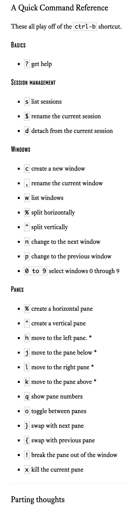

## About Session
---
New session：

`tmux new -s session-name`

Detaching from a session：

`ctrl–b–d`

`tmux detach`

Show existing sessions:

`tmux ls`

Attaching to an existing session:

`tmux attach -t 0`

`tmux attach -t session-name`

Killing a session:

`tmux kill-session -t session-name`

